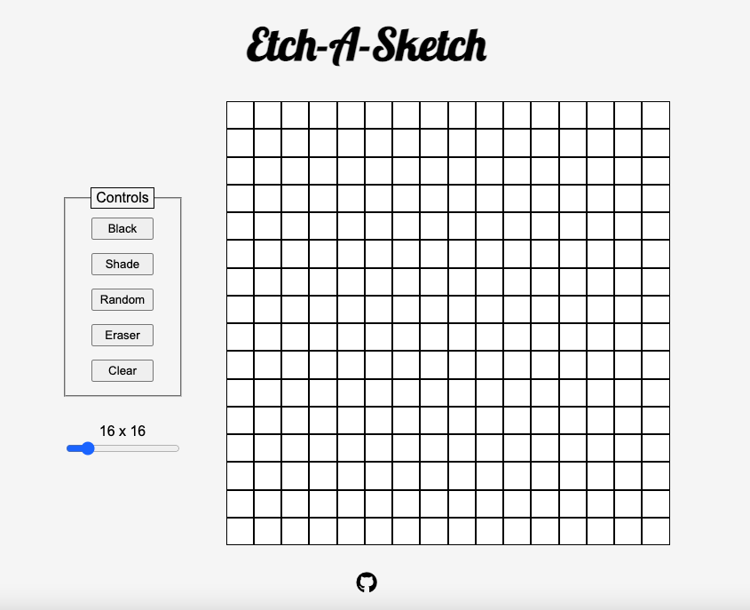

# Etch-A-Sketch
Created an Etch-A-Sketch as part of the The Odin Project curriculum. It was made using HTML, CSS and vanilla Javascript. 

[Live Demo](https://ko1122.github.io/etch-a-sketch/)

[The Odin Project: Etch-A-Sketch](https://www.theodinproject.com/lessons/foundations-etch-a-sketch)

